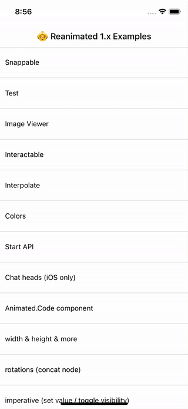

# Reanimated v1 Example



## Try now

Scan this qr to open project with [Expo](https://expo.io)


## Run the project

Clone this project and run:

```
yarn install
expo start
```

## Reanimated v1 document

https://docs.swmansion.com/react-native-reanimated/docs/1.x.x/
